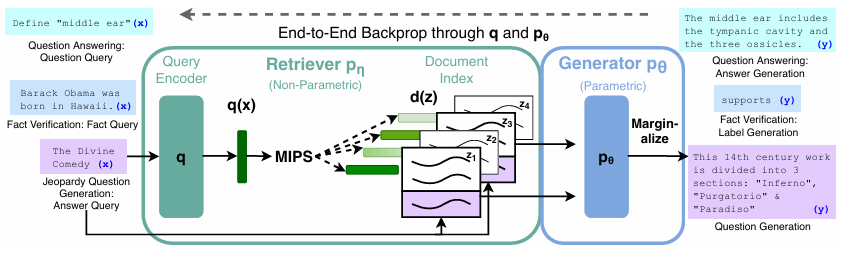
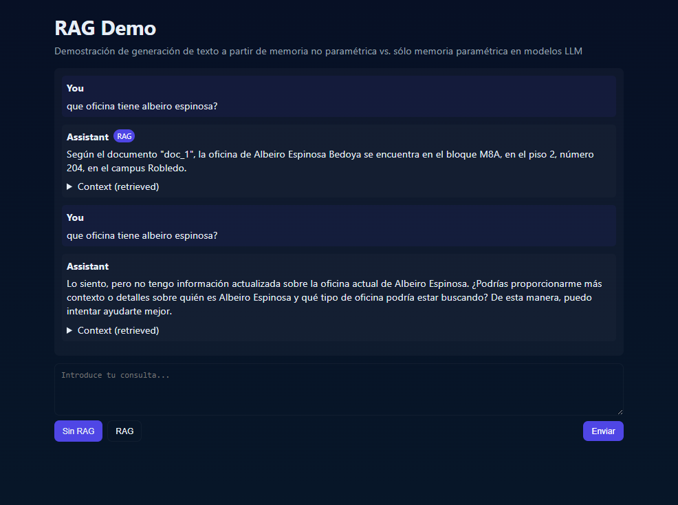

# RAG Chatbot Demo 

This repository contains a minimal chatbot template that demonstrates RAG (Retrieval-Augmented Generation) vs no-RAG behavior when querying an LLM.

Inspired to show RAG architecture from the work "Retrieval-Augmented Generation for
Knowledge-Intensive NLP Tasks" (Lewis et al., 2020) https://arxiv.org/abs/2005.11401




The dense vector can be replaced with any FAISS vector_db, it's easily swapable, you will only need to replace the existent data/FAISS/vector_db with your dense vector.

Structure
- `client/` — minimal Vite + React app (UI). Use `npm install` then `npm run dev` to run.
- `server.py` — lightweight Python HTTP server (no external dependencies) exposing `POST /api/chat`.

API
- POST http://localhost:8000/api/chat
  - body: { "query": string, "useRag": boolean }
  - response: { "reply": string, "usedRag": boolean, "context": [ ... ] }

How it demonstrates RAG
- When `useRag` is true, the server simulates a retrieval step (returns mock context) and includes it in the prompt used to generate the reply.
- When `useRag` is false, the server generates a reply without context.

Quick run (server only)

Open PowerShell and run:

```powershell
python .\server.py
```

Then open the client (optional):

- From `client/` run `npm install` then `npm run dev` to start the React dev server at `http://localhost:5173` (default Vite port). The client calls `http://localhost:8000/api/chat`.

Notes: 
- Make sure to have the following API keys in your .env file:
  - `OPENAI_API_KEY`
  - `GROQ_API_KEY`


### How it works
The existent dense vector contains information about subjects and its prerequisites, types according to different majors, number of credits, and information about teachers from Universidad nacional de colombia - Sede Medellín.


